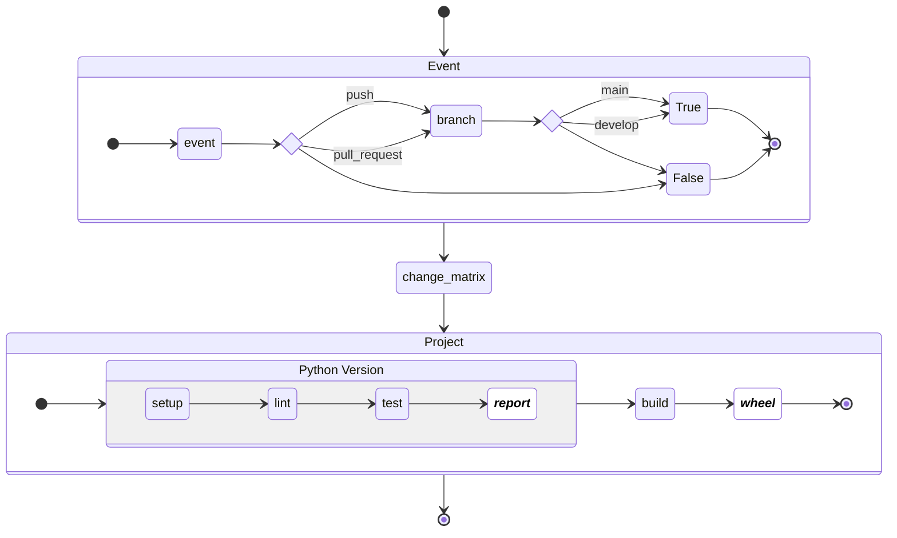
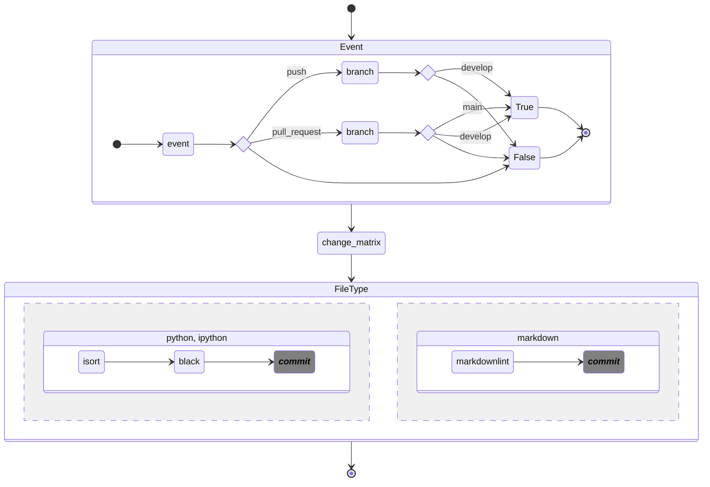

# Github Actions

## Pattern

* <https://waylonwalker.com/hatch-version/>

## Workflows

1. Continuous Integration
    * On every PR, run tests for all packages changed between head and base
2. Continuous Deploy
    * On `release/*` and `hotfix/*` branches after CI
    * On push to develop (with relevant changes)

### Continuous Integration (CI)

### Format

